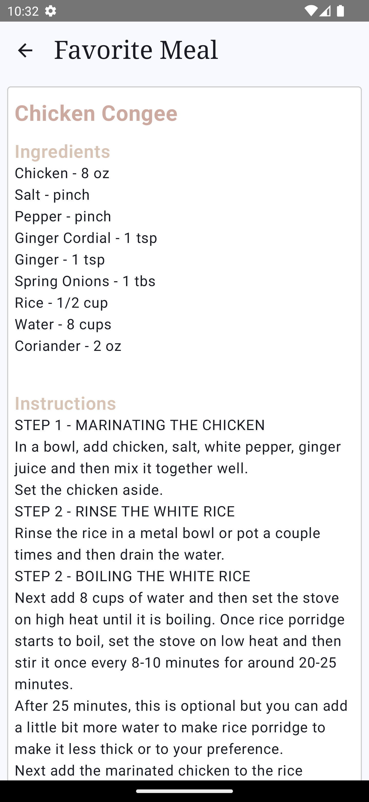

# RecipeBox App

## Introduction
This project, you can access recipes with the mealDB API, watch videos on how the recipes are made, and find the dishes you are looking for. You can add the recipes you like to your favorites and access them without internet. If you can't decide what to eat, you can get help from ChatAI.
## Features

The main features of this project include:

- You can easily access the recipe you want with the application.
- You can discover new tastes thanks to the food suggestions in the application.
- You can access the detailed ingredient list and how to make the recipes.
- You can watch the recipe by clicking on the youtube link.
- You can add the dishes you like to your favorites.
- You can create custom menus with ChatAI.
- You can access the latest recipes via notifications.
- The application has Turkish and English language support. 

## Tech Stacks

This project is trying to use the latest Android tech stacks.

- Language: [Kotlin](https://kotlinlang.org)
- Architecture: [Android App Architecture (MVVM) ](https://developer.android.com/topic/architecture)
- User Interface: [Jetpack Compose](https://developer.android.com/jetpack/compose)
- Concurrency: [Coroutines](https://kotlinlang.org/docs/coroutines-overview.html)
- Dependency Injection: [Hilt](https://developer.android.com/training/dependency-injection/hilt-android)
- Remote Database: [Retrofit](https://square.github.io/retrofit/)
- Local Database: [Room](https://developer.android.com/jetpack/androidx/releases/room)
- Image Loading: [Coil](https://coil-kt.github.io) 
- Others:
  - [Jetpack Compose Extensions](https://google.github.io/accompanist)
  - [SplashScreen](https://developer.android.com/develop/ui/views/launch/splash-screen)
  - [Admob](https://admob.google.com/intl/tr/home/)
  - [Google Play Review](https://developer.android.com/guide/playcore/in-app-review)
  - [ChatGPT](https://openai.com/)
  - [Firebase Notification](https://firebase.google.com/docs/cloud-messaging?hl=tr)

## API Used

- [OpenAI](https://platform.openai.com/docs/overview)
- [TheMealDB](https://www.themealdb.com/api.php)
- [My Service](http://www.yildirimenes.com/recipebox/slider_one.png) [Load Homepage Images]

## User Interfaces
  <table>
  <tr>
  <td></td>
  <td></td>
  <td></td>
  </tr>
</table>
<table>
  <tr>
  <td></td>
  <td></td>
  <td></td>
  </tr>
</table>
<table>
  <tr>
  <td></td>
  <td></td>
  <td></td>
  </tr>
</table>


## Download

### If You Want to Use the App on an Android Phone:

* You can download the apk file of the app by clicking [here](https://drive.google.com/drive/folders/1x-RKA3PTVTkzYobFnk5Q6EnWSqy8-QSx) and install the app on your phone.

## Clone Project

1. Clone this repository to your preferred directory using the following command:

```
git clone https://github.com/yildirimenes/PaparaFinalProject.git
```
2. Open the cloned project in Android Studio.

3. Build and run the app on an emulator or a physical device.


## License
This project is licensed under the Apache License, Version 2.0. See the [LICENSE](LICENSE) file for details.
